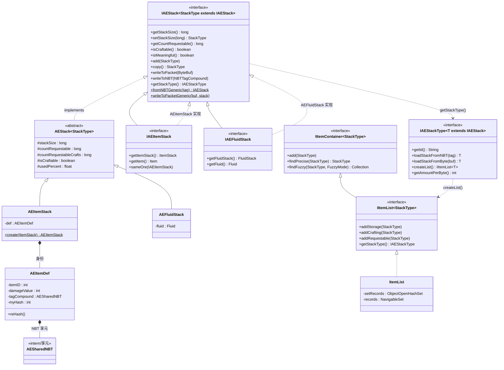
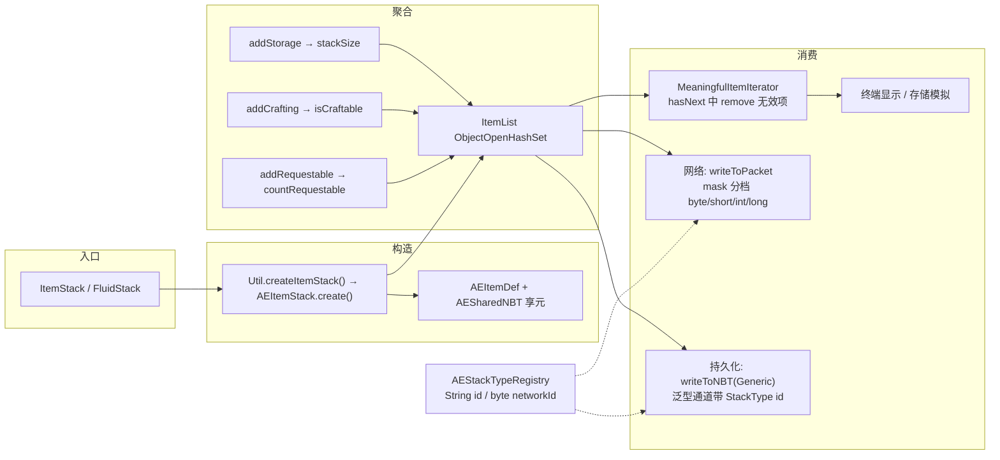

# IAEStack 设计层次解析

> 基于 `tools/Applied-Energistics-2-Unofficial-rv3-beta-1050-GTNH`（GTNH 版 AE2，rv3.beta.1050）源码分析。

## 1. 总览

`IAEStack` 是 AE2 对 MC 原生 `ItemStack` / `FluidStack` 的**统一抽象**：把"物品身份"与"数量"拆开，用 `long` 计数支持超大存储，并在其上叠加 stored / craftable / requestable 等多维语义。整体分为四层：

| 层次 | 包 | 角色 | 关键类型 |
|---|---|---|---|
| L1 API 抽象层 | `appeng.api.storage.data` | 面向 MOD 作者的接口契约 | `IAEStack`、`IAEItemStack`、`IAEFluidStack`、`IItemList`、`IItemContainer` |
| L2 类型系统 | `appeng.api.storage.data` | 栈类型的元描述与注册 | `IAEStackType`、`AEStackTypeRegistry`、`StorageChannel` |
| L3 实现层 | `appeng.util.item` | 接口的内部实现（禁止外部实现） | `AEStack`、`AEItemStack`、`AEFluidStack`、`ItemList` |
| L4 支撑设施 | `appeng.util.item` | 身份/去重/序列化 | `AEItemDef`、`AESharedNBT`、`MeaningfulItemIterator` |



## 2. L1 — API 抽象层：`IAEStack` 自身

### 2.1 CRTP 自引用泛型

```java
39:public interface IAEStack<StackType extends IAEStack> {
```

见 [`IAEStack.java#L39`](../../tools/Applied-Energistics-2-Unofficial-rv3-beta-1050-GTNH/src/main/java/appeng/api/storage/data/IAEStack.java#L39)。所有"变更类"方法返回 `StackType` 而非 `IAEStack`，例如 `setStackSize(long) StackType`、`setCraftable(boolean) StackType`、`copy()`、`reset()`。这样 `IAEItemStack` 上调用 `copy()` 得到的是 `IAEItemStack` 而不是丢失类型，形成流式 API（[`AEStack.setStackSize()`](../../tools/Applied-Energistics-2-Unofficial-rv3-beta-1050-GTNH/src/main/java/appeng/util/item/AEStack.java#L63) 中以 `(StackType) this` 强转实现）。

### 2.2 数量语义：一个对象承载四组计数

| 计数 | 方法 | 语义 |
|---|---|---|
| `stackSize` | `getStackSize` / `setStackSize` / `incStackSize` / `decStackSize` | 实际存储量（替代 `ItemStack.stackSize` 的 `int`，改用 `long`） |
| `countRequestable` | `getCountRequestable` / `inc/decCountRequestable` | 已请求未提取量（LP 集成场景） |
| `countRequestableCrafts` | `getCountRequestableCrafts`（default 0） | 合成模拟中的请求次数 |
| `usedPercent` | `getUsedPercent`（default 0） | 合成中消耗百分比 |

`isCraftable()` 标记"可合成"状态；`isMeaningful()` 判定记录是否有效（`stackSize != 0 || countRequestable > 0 || isCraftable`，见 [`AEStack.java#L124`](../../tools/Applied-Energistics-2-Unofficial-rv3-beta-1050-GTNH/src/main/java/appeng/util/item/AEStack.java#L124)），是整个列表自清理机制的基础（见 §5.3）。

### 2.3 序列化：专属 + 泛型双通道

- **专属通道**：[`writeToNBT()`](../../tools/Applied-Energistics-2-Unofficial-rv3-beta-1050-GTNH/src/main/java/appeng/api/storage/data/IAEStack.java#L173) / [`writeToPacket()`](../../tools/Applied-Energistics-2-Unofficial-rv3-beta-1050-GTNH/src/main/java/appeng/api/storage/data/IAEStack.java#L225)，由子类自行编码。
- **泛型通道**（GTNH 扩展）：[`writeToNBTGeneric`](../../tools/Applied-Energistics-2-Unofficial-rv3-beta-1050-GTNH/src/main/java/appeng/api/storage/data/IAEStack.java#L180) / `toNBTGeneric` / [`fromNBTGeneric`](../../tools/Applied-Energistics-2-Unofficial-rv3-beta-1050-GTNH/src/main/java/appeng/api/storage/data/IAEStack.java#L202)、`writeToPacketGeneric` / `fromPacketGeneric`。写入时先记录 `StackType` 字符串 ID（NBT）或 1 字节网络 ID（packet），再委托 `IAEStackType.loadStackFromNBT / loadStackFromByte` 反序列化，实现"一个 NBT 里装任意类型栈"。

### 2.4 子接口收窄

[`IAEItemStack`](../../tools/Applied-Energistics-2-Unofficial-rv3-beta-1050-GTNH/src/main/java/appeng/api/storage/data/IAEItemStack.java#L29) 与 [`IAEFluidStack`](../../tools/Applied-Energistics-2-Unofficial-rv3-beta-1050-GTNH/src/main/java/appeng/api/storage/data/IAEFluidStack.java#L29) 均为空壳扩展接口：`public interface IAEItemStack extends IAEStack<IAEItemStack>`。Javadoc 明确 **"Don't Implement"**，只能通过 `Util.createItemStack(ItemStack)` 构造——保证实现类由 AE 内部掌控。

## 3. L2 — 类型系统：`IAEStackType` + `AEStackTypeRegistry`

GTNH fork 引入的一层"元类型"，把"栈是什么种类"从实例上抽离为**伴生单例**：

| 能力 | API | 说明 |
|---|---|---|
| 类型标识 | `getId()` / `getDisplayName()` / `getDisplayUnit()` | 如 `"item"`、`"fluid"`，用于 NBT 泛型通道 |
| 工厂 | `createList()` / `createPrimitiveList()` | 为该类型创建 `IItemList` |
| 反序列化 | `loadStackFromNBT` / `loadStackFromByte` | 泛型通道的解码端 |
| 容器交互 | `fillContainer` / `drainStackFromContainer` / `getContainerItemCapacity` | 桶/罐类容器与栈的互转（流体类核心） |
| 存储密度 | `getAmountPerByte()` / `getAmountPerUnit()` | 驱动 `IAECellContainer` 的字节容量计算 |
| 注册 | `AEStackTypeRegistry.register(type)` | 需在 mod **preInit** 阶段完成 |

[`AEStackTypeRegistry`](../../tools/Applied-Energistics-2-Unofficial-rv3-beta-1050-GTNH/src/main/java/appeng/api/storage/data/AEStackTypeRegistry.java#L20) 静态内置 `ITEM_STACK_TYPE` 与 `FLUID_STACK_TYPE`，并在 [`initNetworkIds()`](../../tools/Applied-Energistics-2-Unofficial-rv3-beta-1050-GTNH/src/main/java/appeng/api/storage/data/AEStackTypeRegistry.java#L46) 中按 `getSortedTypes()`（item、fluid 固定在前，其余按 id 字母序）分配 1..127 的稳定 `byte` 网络 ID，供 `writeToPacketGeneric` 每包只写 1 字节定位类型。第三方 MOD（如 ExtraCells 风格的类型）可注册自己的 `IAEStackType` 获得全套支持。

[`StorageChannel`](../../tools/Applied-Energistics-2-Unofficial-rv3-beta-1050-GTNH/src/main/java/appeng/api/storage/StorageChannel.java#L22) 枚举（仅 `ITEMS` / `FLUIDS`）是旧 API 面，`createList()` 最终也落到 `AEApi.storage()`。

## 4. L3 — 实现层：`AEStack` → `AEItemStack` / `AEFluidStack`

### 4.1 `AEStack`：公共字段与紧凑序列化

[`AEStack`](../../tools/Applied-Energistics-2-Unofficial-rv3-beta-1050-GTNH/src/main/java/appeng/util/item/AEStack.java#L31)：`public abstract class AEStack<StackType extends IAEStack<StackType>> implements IAEStack<StackType>`，持有 §2.2 的五个公共字段并实现全部 setter/getter。

网络序列化（[`writeToPacket()`](../../tools/Applied-Energistics-2-Unofficial-rv3-beta-1050-GTNH/src/main/java/appeng/util/item/AEStack.java#L149)）非常精打细算：

- 一个 `mask` 字节编码 3 个计数各自的大小档位（2bit×3）+ isCraftable(1bit) + hasTagCompound(1bit)；
- [`getType(long)`](../../tools/Applied-Energistics-2-Unofficial-rv3-beta-1050-GTNH/src/main/java/appeng/util/item/AEStack.java#L170) 按 ≤255 / ≤65535 / ≤2³² 分档，`putPacketValue` 分别写 byte/short/int/long，并做 `±MIN_VALUE` 偏移避免符号问题；
- 第二个 `mask2` 字节编码 `countRequestableCrafts` 与 `usedPercent`（float×10000 转 long）。

### 4.2 `AEItemStack`：身份与数量彻底分离

[`AEItemStack`](../../tools/Applied-Energistics-2-Unofficial-rv3-beta-1050-GTNH/src/main/java/appeng/util/item/AEItemStack.java#L60)：`final class AEItemStack extends AEStack<IAEItemStack> implements IAEItemStack, Comparable<AEItemStack>`。

关键设计是 [`AEItemDef`](../../tools/Applied-Energistics-2-Unofficial-rv3-beta-1050-GTNH/src/main/java/appeng/util/item/AEItemDef.java#L28)：

- 记录 `itemID`、`damageValue`、`AESharedNBT tagCompound`、Ore 字典归属等**不可变身份**；
- [`reHash()`](../../tools/Applied-Energistics-2-Unofficial-rv3-beta-1050-GTNH/src/main/java/appeng/util/item/AEItemDef.java#L99) 预计算 `myHash = def ^ identityHashCode(tag)`，配合 `ObjectOpenHashSet` 实现近似 O(1) 的 `equals/hashCode`，NBT 只比引用（[`AESharedNBT`](../../tools/Applied-Energistics-2-Unofficial-rv3-beta-1050-GTNH/src/main/java/appeng/util/item/AESharedNBT.java) 享元已 intern），几乎零开销；
- 同一 `AEItemDef` 可挂不同 `stackSize`，实现"千个同物品栈共享一份身份对象"。

NBT 反序列化走 [`loadItemStackFromNBT()`](../../tools/Applied-Energistics-2-Unofficial-rv3-beta-1050-GTNH/src/main/java/appeng/util/item/AEItemStack.java#L120)，键为 `Cnt` / `Req` / `Craft` / `ReqMade` / `UsedPercent`。

### 4.3 `ItemList`：可排序 + 自清理的集合

[`ItemList`](../../tools/Applied-Energistics-2-Unofficial-rv3-beta-1050-GTNH/src/main/java/appeng/util/item/ItemList.java#L32)：`final class ItemList implements IItemList<IAEItemStack>`。

- 默认用 fastutil `ObjectOpenHashSet<IAEItemStack>` 去重合并（[`add()`](../../tools/Applied-Energistics-2-Unofficial-rv3-beta-1050-GTNH/src/main/java/appeng/util/item/ItemList.java#L47) 找到等价元素则 `st.add(option)` 累加，否则 `copy()` 后插入，避免外部可变引用污染）；
- 构造时传 `sorted=true` 则额外建 `ConcurrentSkipListSet`（`records`），支撑终端的有序展示与 fuzzy 区间查找（`findFuzzy` 依赖 `NavigableSet.tailSet`）；
- [`IItemContainer`](../../tools/Applied-Energistics-2-Unofficial-rv3-beta-1050-GTNH/src/main/java/appeng/api/storage/data/IItemContainer.java#L27) 契约：`add` / `findPrecise`（精确查）/ `findFuzzy`（模糊查）/ `isEmpty`；[`IItemList`](../../tools/Applied-Energistics-2-Unofficial-rv3-beta-1050-GTNH/src/main/java/appeng/api/storage/data/IItemList.java#L29) 在其上追加三种累加语义 `addStorage` / `addCrafting` / `addRequestable`（分别落到栈的四组计数上）。

## 5. 三个值得注意的行为细节

### 5.1 泛型 vs 专属序列化的取舍

[`IAEStack.java#L225`](../../tools/Applied-Energistics-2-Unofficial-rv3-beta-1050-GTNH/src/main/java/appeng/api/storage/data/IAEStack.java#L225) 注释直说："Slower for disk saving, but smaller/more efficient for packets."——泛型通道多 1 字节类型 ID，换取跨类型混装；专属通道用于热点路径（cell 内容物逐项编解码）。

### 5.2 网络类型 ID 的稳定性

`getSortedTypes()` 把 item/fluid 固定排最前、其余按 `getId()` 排序（见 [`AEStackTypeRegistry.java#L77`](../../tools/Applied-Energistics-2-Unofficial-rv3-beta-1050-GTNH/src/main/java/appeng/api/storage/data/AEStackTypeRegistry.java#L77)），保证**注册顺序不影响网络 ID 分配**；ID 必须双端一致，故要求注册只发生在 preInit。

### 5.3 迭代器自清理（本项目相关的BUG）

[`MeaningfulItemIterator`](../../tools/Applied-Energistics-2-Unofficial-rv3-beta-1050-GTNH/src/main/java/appeng/util/item/MeaningfulItemIterator.java#L28) 在 [`hasNext()`](../../tools/Applied-Energistics-2-Unofficial-rv3-beta-1050-GTNH/src/main/java/appeng/util/item/MeaningfulItemIterator.java#L28) 中对无效元素直接 `this.parent.remove()`——即 **遍历 `IItemList` 会隐式修改集合**：

```java
if (this.next.isMeaningful()) {
    return true;
} else {
    this.parent.remove(); // self cleaning :3
}
```

底层 `ObjectOpenHashSet` 非线程安全、非 fail-fast，WebAPI 线程并发读 `IItemList` 时可能 `ArrayIndexOutOfBounds/NPE`

通过ASM注入+Mixin实现 [`SafeObjectOpenHashSet`](../../src/main/java/love/shirokasoke/webapi/utils/SafeObjectOpenHashSet.java)与[`IAEStackSafeAccess`](../../src/main/java/love/shirokasoke/webapi/utils/IAEStackSafeAccess.java)实现了修复

## 6. 数据流：一次栈的生命周期



## 7. 关键源文件

| 文件 | 层次 | 要点 |
|------|------|------|
| [`IAEStack.java`](../../tools/Applied-Energistics-2-Unofficial-rv3-beta-1050-GTNH/src/main/java/appeng/api/storage/data/IAEStack.java) | L1 | CRTP 泛型根接口；四组计数；泛型序列化 static 方法 |
| [`IAEItemStack.java`](../../tools/Applied-Energistics-2-Unofficial-rv3-beta-1050-GTNH/src/main/java/appeng/api/storage/data/IAEItemStack.java) / [`IAEFluidStack.java`](../../tools/Applied-Energistics-2-Unofficial-rv3-beta-1050-GTNH/src/main/java/appeng/api/storage/data/IAEFluidStack.java) | L1 | 子接口收窄；Don't Implement |
| [`IItemContainer.java`](../../tools/Applied-Energistics-2-Unofficial-rv3-beta-1050-GTNH/src/main/java/appeng/api/storage/data/IItemContainer.java) | L1 | add/findPrecise/findFuzzy 容器契约 |
| [`IItemList.java`](../../tools/Applied-Energistics-2-Unofficial-rv3-beta-1050-GTNH/src/main/java/appeng/api/storage/data/IItemList.java) | L1 | 三种累加语义；`LIST_*` 字节常量 |
| [`IAEStackType.java`](../../tools/Applied-Energistics-2-Unofficial-rv3-beta-1050-GTNH/src/main/java/appeng/api/storage/data/IAEStackType.java) | L2 | 类型元描述（工厂/反序列化/容器交互/存储密度） |
| [`AEStackTypeRegistry.java`](../../tools/Applied-Energistics-2-Unofficial-rv3-beta-1050-GTNH/src/main/java/appeng/api/storage/data/AEStackTypeRegistry.java) | L2 | String id + byte 网络 ID 注册表 |
| [`StorageChannel.java`](../../tools/Applied-Energistics-2-Unofficial-rv3-beta-1050-GTNH/src/main/java/appeng/api/storage/StorageChannel.java) | L2 | 旧枚举 API 面 |
| [`AEStack.java`](../../tools/Applied-Energistics-2-Unofficial-rv3-beta-1050-GTNH/src/main/java/appeng/util/item/AEStack.java) | L3 | 公共字段 + mask 分档紧凑序列化 |
| [`AEItemStack.java`](../../tools/Applied-Energistics-2-Unofficial-rv3-beta-1050-GTNH/src/main/java/appeng/util/item/AEItemStack.java) / [`AEFluidStack.java`](../../tools/Applied-Energistics-2-Unofficial-rv3-beta-1050-GTNH/src/main/java/appeng/util/item/AEFluidStack.java) | L3 | 具体实现；Comparable |
| [`AEItemStackType.java`](../../tools/Applied-Energistics-2-Unofficial-rv3-beta-1050-GTNH/src/main/java/appeng/util/item/AEItemStackType.java) / [`AEFluidStackType.java`](../../tools/Applied-Energistics-2-Unofficial-rv3-beta-1050-GTNH/src/main/java/appeng/util/item/AEFluidStackType.java) | L3 | `IAEStackType` 内置实现 |
| [`AEItemDef.java`](../../tools/Applied-Energistics-2-Unofficial-rv3-beta-1050-GTNH/src/main/java/appeng/util/item/AEItemDef.java) / [`AESharedNBT.java`](../../tools/Applied-Energistics-2-Unofficial-rv3-beta-1050-GTNH/src/main/java/appeng/util/item/AESharedNBT.java) | L4 | 身份对象 + NBT 享元，缓存 hash |
| [`ItemList.java`](../../tools/Applied-Energistics-2-Unofficial-rv3-beta-1050-GTNH/src/main/java/appeng/util/item/ItemList.java) / [`MeaningfulItemIterator.java`](../../tools/Applied-Energistics-2-Unofficial-rv3-beta-1050-GTNH/src/main/java/appeng/util/item/MeaningfulItemIterator.java) | L4 | fastutil 去重集合 + 自清理迭代器 |
