# 配方处理流程图

[关键检查项与源码速查表](#关键检查项与源码速查表)

```mermaid
flowchart TD
    Tick["【游戏 Tick · 服务端】<br/>━━━━━━━━━━━━━━━━━<br/>GT5 框架每 tick 调用<br/>MTEMultiBlockBase.onPostTick()"] -->|isServerSide| ST

    ST{"mUpdate==0 || mStartUpCheck==0 ?<br/>结构/启动检查计数器到点"} -->|是| CS["checkStructure()<br/>━━━━━━━━━━━━━━━━━<br/>校验多方块结构是否成型<br/>维护 mMachine 标志"]
    ST -->|否| SU
    CS --> SU{"mStartUpCheck &lt; 0 ?<br/>结构已成型"}
    SU -->|否| EndT(["本 tick 不进入机器运行"])
    SU -->|是| M{"mMachine ?<br/>结构是否有效"}
    M -->|否| Stop1["stopMachine(STRUCTURE_INCOMPLETE)"]
    M -->|是| CM["checkMaintenance()<br/>━━━━━━━━━━━━━━━━━<br/>检查扳手/螺丝刀等维护工具<br/>污染/损坏状态"]
    CM --> RS{"getRepairStatus() &gt; 0 ?<br/>维护是否足够"}
    RS -->|否| Stop2["stopMachine(NO_REPAIR)"]
    RS -->|是| RM["runMachine()<br/>━━━━━━━━━━━━━━━━━<br/>机器运行主循环"]

    RM --> MP{"mMaxProgresstime &gt; 0 ?<br/>机器是否正在加工"}
    MP -->|是| ORT["onRunningTick()<br/>━━━━━━━━━━━━━━━━━<br/>推进 mProgresstime<br/>产出已完成物品/流体<br/>计算污染"]
    ORT --> DONE{"mProgresstime &gt;= mMaxProgresstime ?<br/>本配方加工完成"}
    DONE -->|否| EndT
    DONE -->|是| REC(["checkRecipe()<br/>加工完成后立即重查下一个配方"])
    MP -->|否| IDLE{"shouldCheckRecipeThisTick()<br/>|| hasWorkJustBeenEnabled()<br/>|| hasInventoryBeenModified() ?<br/>空闲时按节流策略决定是否检查"}
    IDLE -->|否| EndT
    IDLE -->|是| REC2(["checkRecipe()<br/>空闲触发配方检查"])

    REC --> CR0
    REC2 --> CR0

    CR0["startRecipeProcessing()<br/>━━━━━━━━━━━━━━━━━<br/>加锁，准备配方处理上下文<br/>（checkRecipe 为 final 方法）"]
    CR0 --> CP["checkProcessing()<br/>━━━━━━━━━━━━━━━━━<br/>配方处理总入口"]
    CP --> SU0["setupProcessingLogic(processingLogic)<br/>━━━━━━━━━━━━━━━━━<br/>每次检查配方前重置逻辑"]
    SU0 --> SU1["logic.clear()<br/>setMachine(this)<br/>setRecipeMapSupplier(this::getRecipeMap)<br/>setVoidProtection(protectsExcessItem, protectsExcessFluid)<br/>setBatchSize(isBatchModeEnabled ? getMaxBatchSize : 1)<br/>setRecipeLocking(this, isRecipeLockingEnabled)"]
    SU1 --> SPP["setProcessingLogicPower(logic)<br/>━━━━━━━━━━━━━━━━━<br/>useSingleAmp = (能源仓==1 且 无 Exotic 能源仓)<br/>voltage = getAverageInputVoltage()  // 机器平均输入电压<br/>amperage = useSingleAmp ? 1 : getMaxInputAmps()  // 总安培<br/>amperageOC = true<br/>availableEUt = voltage × amperage  // 机器可用总功率"]

    SPP --> DCR["doCheckRecipe()<br/>━━━━━━━━━━━━━━━━━<br/>遍历 mDualInputHatches / mInputHatches / mInputBuses<br/>对每组输入调用 processingLogic.process()"]
    DCR --> PROC["processingLogic.process()<br/>━━━━━━━━━━━━━━━━━<br/>查找配方 → validateAndCalculateRecipe()"]
    PROC --> VR["validateRecipe(recipe)<br/>━━━━━━━━━━━━━━━━━<br/>子类可重写，默认返回 SUCCESSFUL"]
    VR --> VROK{"result.wasSuccessful() ?"}
    VROK -->|否| SKIP(["CalculationResult.ofFailure<br/>跳过此配方，继续下一个"])

    VROK -->|是| CREATE["createParallelHelper(recipe)<br/>createOverclockCalculator(recipe)<br/>helper.setCalculator(calculator)<br/>helper.build()"]
    CREATE --> DP0

    subgraph DP["ParallelHelper.determineParallel()  — 计算并行数  (build 内部调用)"]
        DP0{"【判定1】maxParallel ≤ 0 ?<br/>机器允许的并行数是否非正"}
        DP0 -->|是| DPend(["【中止】直接返回<br/>result 保持为 NONE<br/>currentParallel = 0"])
        DP0 -->|否| DP1["【预处理】输入空值兜底<br/>━━━━━━━━━━━━━━━━━<br/>itemInputs == null → 空数组<br/>fluidInputs == null → 空数组<br/>避免后续 NPE"]
        DP1 --> DP2{"【判定2】!consume ?<br/>是否不消耗输入(仅模拟)"}
        DP2 -->|是| DP2a["【复制输入】copyInputs()<br/>━━━━━━━━━━━━━━━━━<br/>深拷贝 itemInputs/fluidInputs<br/>避免修改真实库存"]
        DP2 -->|否| DP3
        DP2a --> DP3{"【判定3】calculator == null ?<br/>是否未注入超频计算器"}
        DP3 -->|是| DP3a["【兜底构建】新建默认 OverclockCalculator<br/>━━━━━━━━━━━━━━━━━<br/>setEUt(availableEUt)<br/>setRecipeEUt(recipe.mEUt)<br/>setDuration(recipe.mDuration)<br/>setEUtDiscount(eutModifier)"]
        DP3 -->|否| DP4
        DP3a --> DP4["【计算配方功率】应用热折扣与EU修正<br/>━━━━━━━━━━━━━━━━━<br/>heatDiscount = calculator.calculateHeatDiscountMultiplier()<br/>  // 每超过配方温度 900K 折扣一次，每次乘 heatDiscountExponent（默认 0.95）<br/>  // 即 heatDiscountExponent^((machineHeat - recipeHeat) / 900)<br/>tRecipeEUt = ceil(recipeEUt × eutModifier × heatDiscount)<br/>  // 单次配方实际需要的 EU/t"]
        DP4 --> DP5{"【① 功率检查】<br/>availableEUt &lt; tRecipeEUt ?<br/>机器总功率是否足够单次配方"}
        DP5 -->|是| DP5F(["【失败】→ insufficientPower(tRecipeEUt)<br/>提示需要的功率，return"])
        DP5 -->|否| DP6{"【② 电压检查】<br/>!calculator.getAllowedTierSkip() ?<br/>配方EUt 是否超过 机器电压×4^maxTierSkips"}
        DP6 -->|是| DP6F(["【失败】→ insufficientVoltage(tRecipeEUt)<br/>跨级运行不被允许，return"])
        DP6 -->|否| DP7["【保存原始并行】<br/>━━━━━━━━━━━━━━━━━<br/>originalMaxParallel = maxParallel<br/>calculator.setParallel(originalMaxParallel)"]
        DP7 --> DP8{"【判定4】hasDurationUnderOneTickSupplier() ?<br/>是否有自定义亚tick时长供给器<br/>(如中子活化器)"}
        DP8 -->|是| DP8a{"【判定4a】supplier &lt; 1 ?<br/>单次时长是否小于1tick"}
        DP8a -->|是| DP8a1["【放大并行】maxParallel /= supplier<br/>━━━━━━━━━━━━━━━━━<br/>单次太快，按比例放大并行数<br/>以填满1tick"]
        DP8a -->|否| DP8b
        DP8a1 --> DP9
        DP8 -->|否| DP8b["【放大并行】maxParallel ×= calculateMultiplierUnderOneTick()<br/>━━━━━━━━━━━━━━━━━<br/>无自定义供给器，按公式估算<br/>亚tick所需并行倍率"]
        DP8b --> DP9{"【判定5】batchMode ?<br/>是否启用批量模式"}
        DP9 -->|是| DP9a["【批量放大】maxParallel ×= batchModifier<br/>━━━━━━━━━━━━━━━━━<br/>批量模式下按 batchModifier 放大<br/>同时会延长时长"]
        DP9 -->|否| DP10
        DP9a --> DP10["【输出截断】<br/>━━━━━━━━━━━━━━━━━<br/>按 machine.getItemOutputLimit()<br/>与 getFluidOutputLimit() 截断配方输出列表"]
        DP10 --> DP11{"【判定6】isRecipeLocked &&<br/>singleRecipeMachine != null ?<br/>机器是否锁定单一配方"}
        DP11 -->|是| DP11a{"【判定6a】recipeCheck == null ?<br/>尚未构建配方检查器"}
        DP11a -->|是| DP11b{"【判定6b】recipeMap != null ?<br/>存在可用配方表"}
        DP11b -->|是| DP11b1["【构建检查器】SingleRecipeCheck.builder(recipeMap)<br/>.setBefore(itemInputs, fluidInputs)<br/>━━━━━━━━━━━━━━━━━<br/>准备后续 .setAfter+build<br/>建立输入校验缓存"]
        DP11b -->|否| DP12
        DP11b1 --> DP12
        DP11a -->|否| DP12
        DP11 -->|否| DP12{"【判定7】protectExcessItem<br/>|| protectExcessFluid ?<br/>是否启用输出仓保护(void protection)"}
        DP12 -->|是| DP12a{"【判定7a】machine == null ?<br/>启用了保护但未设置机器"}
        DP12a -->|是| DP12aF(["【异常】throw IllegalStateException<br/>保护模式必须提供 machine"])
        DP12a -->|否| DP12b["【VoidProtection】构建输出保护助手<br/>━━━━━━━━━━━━━━━━━<br/>VoidProtectionHelper.build()<br/>maxParallel = min(voidProt.max, maxParallel)<br/>// 不能超过输出仓剩余容量"]
        DP12b --> DP12c{"【判定7b】isItemFull ?<br/>物品输出仓是否已满"}
        DP12c -->|是| DP12cF(["【失败】→ ITEM_OUTPUT_FULL<br/>return"])
        DP12c -->|否| DP12d{"【判定7c】isFluidFull ?<br/>流体输出仓是否已满"}
        DP12d -->|是| DP12dF(["【失败】→ FLUID_OUTPUT_FULL<br/>return"])
        DP12d -->|否| DP13
        DP12 -->|否| DP13["【③ 并行功率限制】<br/>━━━━━━━━━━━━━━━━━<br/>actualMaxParallel = tRecipeEUt &gt; 0 ?<br/>  min(maxParallel, availableEUt / tRecipeEUt) : maxParallel<br/>// 受总功率与单次配方功耗共同约束"]
        DP13 --> DP14{"【判定8】recipeCheck != null ?<br/>是否已有配方检查器(锁配方)"}
        DP14 -->|是| DP14a["【快速校验】currentParallel = recipeCheck.checkRecipeInputs(true, actualMaxParallel, ...)<br/>━━━━━━━━━━━━━━━━━<br/>使用预构建校验器，更快<br/>同时消费输入"]
        DP14 -->|否| DP14b["【通用校验】currentParallel = maxParallelCalculator.calculate(recipe, actualMaxParallel, ...)<br/>━━━━━━━━━━━━━━━━━<br/>通用方法计算最大可执行并行数"]
        DP14b --> DP14c{"【判定8a】currentParallel &gt; 0 ?<br/>是否成功计算到并行"}
        DP14c -->|是| DP14d{"【判定8b】tSingleRecipeCheckBuilder != null ?<br/>需要首次构建单一配方检查器"}
        DP14d -->|是| DP14d1["【首构建+消费】<br/>━━━━━━━━━━━━━━━━━<br/>1) consume(recipe, 1, ...) 先消费1次<br/>2) builder.setAfter+setRecipe+build<br/>3) singleRecipeMachine.setSingleRecipeCheck(built)<br/>4) consume(recipe, currentParallel-1, ...) 消费剩余"]
        DP14d -->|否| DP14d2["【常规消费】inputConsumer.consume(recipe, currentParallel, ...)"]
        DP14c -->|否| DP15
        DP14d1 --> DP15
        DP14d2 --> DP15
        DP14a --> DP15{"【判定9】currentParallel ≤ 0 ?<br/>最终并行是否为0(异常)"}
        DP15 -->|是| DP15F(["【失败】→ INTERNAL_ERROR<br/>return"])
        DP15 -->|否| DP16["【超频计算】calculator.setCurrentParallel(currentParallel).calculate()<br/>━━━━━━━━━━━━━━━━━<br/>传入实际并行数<br/>触发 OverclockCalculator.calculateOverclock()"]
        DP16 --> OC0
        DP16 --> DP17{"【判定10】batchMode && currentParallel &gt; 0<br/>&& duration &lt; 128 ?<br/>批量模式下还有亚tick余量"}
        DP17 -->|是| DP17a["【批量加并行】<br/>━━━━━━━━━━━━━━━━━<br/>batchMultiplierMax = 128 / duration<br/>maxExtra = min(currentParallel×(max-1), maxParallel-current)<br/>tExtraParallels = checkRecipeInputs/calculate(maxExtra)<br/>currentParallel += tExtraParallels<br/>durationMultiplier = 1 + extra/current"]
        DP17 -->|否| DP18
        DP17a --> DP18{"【判定11】calculateOutputs &&<br/>currentParallel &gt; 0 ?<br/>需要计算并放大输出"}
        DP18 -->|是| DP18a["【输出计算】<br/>━━━━━━━━━━━━━━━━━<br/>calculateItemOutputs(truncatedItemOutputs)<br/>  // 含概率输出，正态/二项分布<br/>calculateFluidOutputs(truncatedFluidOutputs)<br/>  // 按 currentParallel 线性放大"]
        DP18 -->|否| DP19
        DP18a --> DP19(["【并行阶段完成】→ SUCCESSFUL<br/>currentParallel 已确定"])
    end

    subgraph OC["OverclockCalculator.calculateOverclock()  — 超频计算  (calculator.calculate() 内部)"]
        OC0["【基础参数】<br/>━━━━━━━━━━━━━━━━━<br/>duration = supplier != null ? supplier.get() : duration × durationModifier<br/>  // 自定义时长或基础时长×速度修正<br/>recipePower = recipeEUt × parallel × eutModifier × heatDiscount<br/>  // 配方总功率（并行后，已含热折扣）<br/>machinePower = voltage × (amperageOC ? amperage : min(amperage, parallel))<br/>  // 机器总功率(考虑安培超频开关)<br/>tiersAbove = log4(machinePower / max(recipePower, 32))<br/>  // 可超频的电压层数"]
        OC0 --> OC1{"【判定12】noOverclock ?<br/>机器是否禁用超频"}
        OC1 -->|是| OC1a(["【无超频】<br/>━━━━━━━━━━━━━━━━━<br/>consumption = ceil(recipePower)<br/>duration = ceil(duration)<br/>return"])
        OC1 -->|否| OC2{"【判定13】laserOC ?<br/>是否使用激光超频(特异机器)"}
        OC2 -->|是| OC2a["【激光超频】两段循环<br/>━━━━━━━━━━━━━━━━━<br/>① 常规OC: while eut×4 &lt; machinePower &&<br/>   regularOverclocks &lt; maxRegularOverclocks<br/>   eut ×= 4, regularOverclocks++<br/>② 激光OC: while power &lt; limit && duration &gt; 1tick<br/>   multiplier = 4 + 0.3×(n+1)<br/>   eut ×= multiplier, laserOverclocks++<br/>overclocks = regular + laser"]
        OC2a --> OC7
        OC2 -->|否| OC3["【常规超频上限】overclocks = min(maxOverclocks, tiersAbove)<br/>━━━━━━━━━━━━━━━━━<br/>受最大OC层数与可超层数双重限制"]
        OC3 --> OC4{"【判定14】!amperageOC ?<br/>是否禁用安培超频(仅按电压层级)"}
        OC4 -->|是| OC4a["【电压层限制】overclocks = min(overclocks,<br/>voltageTierMachine - voltageTierRecipe)<br/>━━━━━━━━━━━━━━━━━<br/>log4ceil(machineVoltage/8) - log4ceil(recipeEUt/8)<br/>不允许跨安培超频"]
        OC4 -->|否| OC5
        OC4a --> OC5["【下限保护】overclocks = max(overclocks, 0)<br/>━━━━━━━━━━━━━━━━━<br/>避免 >1A 配方因层数差为负导致报错"]
        OC5 --> OC6["【热/常规拆分】<br/>━━━━━━━━━━━━━━━━━<br/>heatOverclocks = min(heatOC ? (machineHeat-recipeHeat)/1800 : 0, overclocks)<br/>  // 每 1800K 温差提供1层热超频(EBF)，优先占用总超频层数<br/>regularOverclocks = overclocks - heatOverclocks"]
        OC6 --> OC7["【最终功耗与时长】<br/>━━━━━━━━━━━━━━━━━<br/>consumption = ceil(recipePower × eutIncreasePerOC^overclocks)<br/>  // 每 OC 功耗 ×4(默认)<br/>duration /= durationDecreasePerHeatOC^heatOverclocks<br/>  // 热超频每层时长 ÷4（从总超频层数中优先扣除）<br/>duration /= durationDecreasePerOC^regularOverclocks<br/>  // 常规超频每层时长 ÷2(默认)<br/>duration = max(duration, 1)<br/>  // 不低于1tick"]
    end

    OC7 --> DP17
    OC1a --> DP17

    DP19 --> HROK{"helper.getResult().wasSuccessful() ?"}
    HROK -->|否| HFAIL(["CalculationResult.ofFailure(helper.getResult)<br/>跳过此配方，继续下一个"])
    HROK -->|是| Apply0

    subgraph Apply["ProcessingLogic.applyRecipe()  — 应用配方结果  (ofSuccess)"]
        Apply0{"【判定15】recipe.mCanBeBuffered ?<br/>配方是否允许缓冲缓存"}
        Apply0 -->|是| Apply0a["【缓存配方】lastRecipe = recipe<br/>━━━━━━━━━━━━━━━━━<br/>下次可优先匹配此配方"]
        Apply0 -->|否| Apply0b["【不缓存】lastRecipe = null"]
        Apply0a --> Apply1
        Apply0b --> Apply1["【记录并行】calculatedParallels = helper.getCurrentParallel()<br/>━━━━━━━━━━━━━━━━━<br/>供 GUI 显示并行数"]
        Apply1 --> Apply2{"【判定16】getConsumption() == Long.MAX_VALUE ?<br/>功耗是否溢出(超过 long 范围)"}
        Apply2 -->|是| Apply2F(["【失败】→ POWER_OVERFLOW"])
        Apply2 -->|否| Apply3{"【判定17】getDuration() == Integer.MAX_VALUE ?<br/>时长是否溢出(超过 int 范围)"}
        Apply3 -->|是| Apply3F(["【失败】→ DURATION_OVERFLOW"])
        Apply3 -->|否| Apply4["【计算最终功耗/时长】<br/>━━━━━━━━━━━━━━━━━<br/>calculatedEut = consumption  // 写入最终 EU/t<br/>finalDuration = duration × durationMultiplier<br/>  // 批量模式会延长时长"]
        Apply4 --> Apply5{"【判定18】finalDuration ≥ Integer.MAX_VALUE ?<br/>合并批量倍率后是否仍然溢出"}
        Apply5 -->|是| Apply5F(["【失败】→ DURATION_OVERFLOW"])
        Apply5 -->|否| Apply6["【定型时长 + 启动钩子】<br/>━━━━━━━━━━━━━━━━━<br/>duration = (int) finalDuration<br/>onRecipeStart(recipe)  // 子类可重写<br/>  // 此时输入已消费，输出尚未设置"]
        Apply6 --> Apply7{"【判定19】hookResult.wasSuccessful ?<br/>启动钩子是否通过"}
        Apply7 -->|否| Apply7F(["【失败】→ void 所有已消费输入<br/>返回 hook 失败结果"])
        Apply7 -->|是| Apply8(["【设置输出】<br/>━━━━━━━━━━━━━━━━━<br/>outputItems = helper.getItemOutputs()<br/>outputFluids = helper.getFluidOutputs()<br/>→ SUCCESSFUL  // process() 返回"])
    end

    Apply8 --> CONSUMED(["CalculationResult.ofSuccess<br/>successfullyConsumedInputs = true<br/>返回 checkRecipeResult"])
    SKIP --> NEXT
    HFAIL --> NEXT
    Apply2F --> NEXT
    Apply3F --> NEXT
    Apply5F --> NEXT
    Apply7F --> NEXT
    NEXT{"doCheckRecipe 还有下一个 hatch/配方 ?"}
    NEXT -->|是| PROC
    NEXT -->|否| PCR

    PCR["postCheckRecipe(result, processingLogic)<br/>━━━━━━━━━━━━━━━━━<br/>额外校验: getCalculatedEut() &lt;= Integer.MAX_VALUE"]
    PCR --> UPD["updateSlots()<br/>━━━━━━━━━━━━━━━━━<br/>刷新输入/输出槽位"]
    UPD --> OK{"result.wasSuccessful() ?"}
    OK -->|否| RET(["返回失败结果<br/>mMaxProgresstime 保持 0<br/>displayError"])
    OK -->|是| MAPP["应用结果<br/>━━━━━━━━━━━━━━━━━<br/>mEfficiency / mEfficiencyIncrease<br/>mMaxProgresstime = processingLogic.getDuration()<br/>setEnergyUsage() → mEUt<br/>mOutputItems = getOutputItems()<br/>mOutputFluids = getOutputFluids()"]
    MAPP --> SND["sendStartMultiBlockSoundLoop()<br/>━━━━━━━━━━━━━━━━━<br/>播放运行音效"]
    SND --> ERP["endRecipeProcessing()<br/>━━━━━━━━━━━━━━━━━<br/>解锁，清理上下文"]
    ERP --> RT(["checkRecipe() 返回 true<br/>机器开始加工 mMaxProgresstime tick"])
```

**节流说明（`shouldCheckRecipeThisTick`）**：空闲状态下并非每 tick 都查配方——
- 任意输入仓（DualInput/SmartInput）`justUpdated()` → 立即检查
- 距上次工作 ≥ `CHECK_INTERVAL` → 按 `(mTotalRunTime+offset) % CHECK_INTERVAL == 0` 检查
- 距上次工作 5/12/20/30/40/55/85 tick 时检查（批量模式更保守，不查）

**实例创建时机**：`processingLogic` 在机器构造时由 `createProcessingLogic()` 一次性创建（子类可重写以定制 `maxTierSkips`、`amperageOC` 等默认值），后续每次 `checkProcessing` 只是复用并 `setupProcessingLogic` 重置。

**关键调用嵌套关系**：
- `doCheckRecipe()` 遍历各输入仓，对每组输入调用 `processingLogic.process()`
- `process()` 内部对每个候选配方调用 `validateAndCalculateRecipe()`
- `validateAndCalculateRecipe()` 依次调用 `validateRecipe` → `createParallelHelper` + `createOverclockCalculator` → `helper.build()`（触发 `determineParallel`，内部又触发 `calculator.calculate()`）→ `applyRecipe`
- 全部成功后回到 `doCheckRecipe` 主循环，所有输入仓遍历完毕才进入 `postCheckRecipe`

---

## 关键检查项与源码速查表

> 按流程图实际执行顺序排列。文件路径相对本文档（`docs/GT5/recipe.md`）计算。

### 一、上游阶段（`MTEMultiBlockBase`）

| 序号 | 阶段 / 方法 | 作用 | 源代码位置 |
|------|------------|------|-----------|
| 1 | `onPostTick()` | 游戏 tick 服务端入口，触发结构/维护/运行检查 | [`MTEMultiBlockBase.java#L582`](../../tools/GT5-Unofficial-5.09.51.482/src/main/java/gregtech/api/metatileentity/implementations/MTEMultiBlockBase.java#L582) |
| 2 | `checkStructure()` | 校验多方块结构成型 | [`MTEMultiBlockBase.java#L593`](../../tools/GT5-Unofficial-5.09.51.482/src/main/java/gregtech/api/metatileentity/implementations/MTEMultiBlockBase.java#L593) |
| 3 | `checkMaintenance()` | 维护工具/损坏检查 | [`MTEMultiBlockBase.java#L598`](../../tools/GT5-Unofficial-5.09.51.482/src/main/java/gregtech/api/metatileentity/implementations/MTEMultiBlockBase.java#L598) |
| 4 | `runMachine()` | 机器运行主循环（加工/空闲分支） | [`MTEMultiBlockBase.java#L727`](../../tools/GT5-Unofficial-5.09.51.482/src/main/java/gregtech/api/metatileentity/implementations/MTEMultiBlockBase.java#L727) |
| 5 | `onRunningTick()` | 推进进度、产出物品、污染计算 | [`MTEMultiBlockBase.java#L729`](../../tools/GT5-Unofficial-5.09.51.482/src/main/java/gregtech/api/metatileentity/implementations/MTEMultiBlockBase.java#L729) |
| 6 | `shouldCheckRecipeThisTick()` | 空闲节流策略 | [`MTEMultiBlockBase.java#L696`](../../tools/GT5-Unofficial-5.09.51.482/src/main/java/gregtech/api/metatileentity/implementations/MTEMultiBlockBase.java#L696) |
| 7 | `checkRecipe()` | `final` 入口，加锁 + 调用 `checkProcessing` + 解锁 | [`MTEMultiBlockBase.java#L681`](../../tools/GT5-Unofficial-5.09.51.482/src/main/java/gregtech/api/metatileentity/implementations/MTEMultiBlockBase.java#L681) |
| 8 | `startRecipeProcessing()` / `endRecipeProcessing()` | 配方处理加锁/解锁 | [`MTEMultiBlockBase.java#L682`](../../tools/GT5-Unofficial-5.09.51.482/src/main/java/gregtech/api/metatileentity/implementations/MTEMultiBlockBase.java#L682) |
| 9 | `checkProcessing()` | 配方处理总入口 | [`MTEMultiBlockBase.java#L969`](../../tools/GT5-Unofficial-5.09.51.482/src/main/java/gregtech/api/metatileentity/implementations/MTEMultiBlockBase.java#L969) |
| 10 | `setupProcessingLogic()` | 每次检查前重置 logic | [`MTEMultiBlockBase.java#L1006`](../../tools/GT5-Unofficial-5.09.51.482/src/main/java/gregtech/api/metatileentity/implementations/MTEMultiBlockBase.java#L1006) |
| 11 | `setProcessingLogicPower()` | 注入电压/电流/`amperageOC` | [`MTEMultiBlockBase.java#L1020`](../../tools/GT5-Unofficial-5.09.51.482/src/main/java/gregtech/api/metatileentity/implementations/MTEMultiBlockBase.java#L1020) |
| 12 | `doCheckRecipe()` | 遍历输入仓，调用 `process()` | [`MTEMultiBlockBase.java#L1036`](../../tools/GT5-Unofficial-5.09.51.482/src/main/java/gregtech/api/metatileentity/implementations/MTEMultiBlockBase.java#L1036) |
| 13 | `postCheckRecipe()` | 额外校验 `getCalculatedEut()` 溢出 | [`MTEMultiBlockBase.java#L1177`](../../tools/GT5-Unofficial-5.09.51.482/src/main/java/gregtech/api/metatileentity/implementations/MTEMultiBlockBase.java#L1177) |
| 14 | `createProcessingLogic()` | 机器构造时一次性创建 logic | [`MTEMultiBlockBase.java#L1895`](../../tools/GT5-Unofficial-5.09.51.482/src/main/java/gregtech/api/metatileentity/implementations/MTEMultiBlockBase.java#L1895) |

### 二、配方验证阶段（`ProcessingLogic`）

| 序号 | 阶段 / 方法 | 作用 | 源代码位置 |
|------|------------|------|-----------|
| 15 | `process()` | 查找配方主循环 | [`ProcessingLogic.java#L373`](../../tools/GT5-Unofficial-5.09.51.482/src/main/java/gregtech/api/logic/ProcessingLogic.java#L373) |
| 16 | `validateAndCalculateRecipe()` | 验证 + 创建 helper/calculator + 调用 build + applyRecipe | [`ProcessingLogic.java#L436`](../../tools/GT5-Unofficial-5.09.51.482/src/main/java/gregtech/api/logic/ProcessingLogic.java#L436) |
| 17 | `validateRecipe()` | 子类可重写，默认 SUCCESSFUL | [`ProcessingLogic.java#L528`](../../tools/GT5-Unofficial-5.09.51.482/src/main/java/gregtech/api/logic/ProcessingLogic.java#L528) |
| 18 | `createParallelHelper()` | 创建 ParallelHelper 并注入参数 | [`ProcessingLogic.java#L536`](../../tools/GT5-Unofficial-5.09.51.482/src/main/java/gregtech/api/logic/ProcessingLogic.java#L536) |
| 19 | `createOverclockCalculator()` | 创建 OverclockCalculator 并注入参数 | [`ProcessingLogic.java#L554`](../../tools/GT5-Unofficial-5.09.51.482/src/main/java/gregtech/api/logic/ProcessingLogic.java#L554) |
| 20 | `applyRecipe()` | 应用配方结果（缓存/溢出/钩子/输出） | [`ProcessingLogic.java#L460`](../../tools/GT5-Unofficial-5.09.51.482/src/main/java/gregtech/api/logic/ProcessingLogic.java#L460) |
| 21 | `onRecipeStart()` | 子类可重写的启动钩子 | [`ProcessingLogic.java#L574`](../../tools/GT5-Unofficial-5.09.51.482/src/main/java/gregtech/api/logic/ProcessingLogic.java#L574) |

### 三、并行计算阶段（`ParallelHelper.determineParallel`）

| 序号 | 判定节点 | 检查内容 | 失败结果 / 行为 | 源代码位置 |
|------|---------|---------|----------------|-----------|
| 22 | 判定1 | `maxParallel ≤ 0` | 中止，`NONE` | [`ParallelHelper.java#L376`](../../tools/GT5-Unofficial-5.09.51.482/src/main/java/gregtech/api/util/ParallelHelper.java#L376) |
| 23 | 判定2 | `!consume` | 复制输入 | [`ParallelHelper.java#L386`](../../tools/GT5-Unofficial-5.09.51.482/src/main/java/gregtech/api/util/ParallelHelper.java#L386) |
| 24 | 判定3 | `calculator == null` | 兜底构建 | [`ParallelHelper.java#L390`](../../tools/GT5-Unofficial-5.09.51.482/src/main/java/gregtech/api/util/ParallelHelper.java#L390) |
| 25 | **① 功率检查** | `availableEUt < tRecipeEUt` | `insufficientPower` | [`ParallelHelper.java#L400`](../../tools/GT5-Unofficial-5.09.51.482/src/main/java/gregtech/api/util/ParallelHelper.java#L400) |
| 26 | **② 电压检查** | `!calculator.getAllowedTierSkip()`（`recipeEUt ≤ machineVoltage × 4^maxTierSkip`） | `insufficientVoltage` | [`ParallelHelper.java#L404`](../../tools/GT5-Unofficial-5.09.51.482/src/main/java/gregtech/api/util/ParallelHelper.java#L404) / [`OverclockCalculator.java#L303`](../../tools/GT5-Unofficial-5.09.51.482/src/main/java/gregtech/api/util/OverclockCalculator.java#L303) |
| 27 | 判定4 / 4a | 亚 tick 供给器 / `supplier < 1` | 放大并行 | [`ParallelHelper.java#L415`](../../tools/GT5-Unofficial-5.09.51.482/src/main/java/gregtech/api/util/ParallelHelper.java#L415) |
| 28 | 判定5 | `batchMode` | 批量放大并行 | [`ParallelHelper.java#L423`](../../tools/GT5-Unofficial-5.09.51.482/src/main/java/gregtech/api/util/ParallelHelper.java#L423) |
| 29 | 判定6 / 6a / 6b | `isRecipeLocked` / `recipeCheck == null` / `recipeMap != null` | 构建 SingleRecipeCheck | [`ParallelHelper.java#L436`](../../tools/GT5-Unofficial-5.09.51.482/src/main/java/gregtech/api/util/ParallelHelper.java#L436) |
| 30 | 判定7 | `protectExcessItem \|\| protectExcessFluid` | VoidProtection | [`ParallelHelper.java#L450`](../../tools/GT5-Unofficial-5.09.51.482/src/main/java/gregtech/api/util/ParallelHelper.java#L450) |
| 31 | 判定7a | `machine == null` | `throw IllegalStateException` | [`ParallelHelper.java#L451`](../../tools/GT5-Unofficial-5.09.51.482/src/main/java/gregtech/api/util/ParallelHelper.java#L451) |
| 32 | 判定7b | `isItemFull` | `ITEM_OUTPUT_FULL` | [`ParallelHelper.java#L463`](../../tools/GT5-Unofficial-5.09.51.482/src/main/java/gregtech/api/util/ParallelHelper.java#L463) |
| 33 | 判定7c | `isFluidFull` | `FLUID_OUTPUT_FULL` | [`ParallelHelper.java#L467`](../../tools/GT5-Unofficial-5.09.51.482/src/main/java/gregtech/api/util/ParallelHelper.java#L467) |
| 34 | **③ 并行功率限制** | `actualMaxParallel = min(maxParallel, availableEUt / tRecipeEUt)` | 限制并行数 | [`ParallelHelper.java#L476`](../../tools/GT5-Unofficial-5.09.51.482/src/main/java/gregtech/api/util/ParallelHelper.java#L476) |
| 35 | 判定8 / 8a / 8b | `recipeCheck != null` / `currentParallel > 0` / builder 首次构建 | 快速/通用校验 | [`ParallelHelper.java#L478`](../../tools/GT5-Unofficial-5.09.51.482/src/main/java/gregtech/api/util/ParallelHelper.java#L478) |
| 36 | 判定9 | `currentParallel ≤ 0` | `INTERNAL_ERROR` | [`ParallelHelper.java#L497`](../../tools/GT5-Unofficial-5.09.51.482/src/main/java/gregtech/api/util/ParallelHelper.java#L497) |
| 37 | 判定10 | `batchMode && duration < 128` | 批量加并行 | [`ParallelHelper.java#L505`](../../tools/GT5-Unofficial-5.09.51.482/src/main/java/gregtech/api/util/ParallelHelper.java#L505) |
| 38 | 判定11 | `calculateOutputs && currentParallel > 0` | 计算输出 | [`ParallelHelper.java#L524`](../../tools/GT5-Unofficial-5.09.51.482/src/main/java/gregtech/api/util/ParallelHelper.java#L524) |

### 四、超频计算阶段（`OverclockCalculator.calculateOverclock`）

| 序号 | 判定节点 | 检查内容 | 失败结果 / 行为 | 源代码位置 |
|------|---------|---------|----------------|-----------|
| 39 | **超频层数上限** | `tiersAbove = log4(machinePower / max(recipePower, 32))` | 限制 `overclocks = min(maxOverclocks, tiersAbove)` | [`OverclockCalculator.java#L343`](../../tools/GT5-Unofficial-5.09.51.482/src/main/java/gregtech/api/util/OverclockCalculator.java#L343) / [`#L389`](../../tools/GT5-Unofficial-5.09.51.482/src/main/java/gregtech/api/util/OverclockCalculator.java#L389) |
| 40 | 判定12 | `noOverclock` | 直接用基础值返回 | [`OverclockCalculator.java#L346`](../../tools/GT5-Unofficial-5.09.51.482/src/main/java/gregtech/api/util/OverclockCalculator.java#L346) |
| 41 | 判定13 | `laserOC` | 两段循环超频 | [`OverclockCalculator.java#L353`](../../tools/GT5-Unofficial-5.09.51.482/src/main/java/gregtech/api/util/OverclockCalculator.java#L353) |
| 42 | 判定14 | `!amperageOC` | 按电压层级限制超频 | [`OverclockCalculator.java#L392`](../../tools/GT5-Unofficial-5.09.51.482/src/main/java/gregtech/api/util/OverclockCalculator.java#L392) |
| 43 | 热折扣 | `heatDiscountExponent ^ ((machineHeat - recipeHeat) / 900)`，默认底数 0.95 | 在超频前降低 `tRecipeEUt` 与 `recipePower` | [`OverclockCalculator.java#L327`](../../tools/GT5-Unofficial-5.09.51.482/src/main/java/gregtech/api/util/OverclockCalculator.java#L327) |
| 44 | 热超频 | 取 `(machineHeat - recipeHeat) / 1800` 与 `overclocks` 较小值 | 从总超频层数中扣除，每层时长 ÷4 | [`OverclockCalculator.java#L402`](../../tools/GT5-Unofficial-5.09.51.482/src/main/java/gregtech/api/util/OverclockCalculator.java#L402) |

> **热折扣 vs 热超频的区别**
> - **热折扣（Heat Discount）**是 **EU 修正**：在并行计算与超频计算前，按 `heatDiscountExponent ^ ((machineHeat - recipeHeat) / 900)` 降低 `tRecipeEUt` 和 `recipePower`。默认底数 `heatDiscountExponent = 0.95`，即每超过配方温度 900K 约省 5% EU，可通过 `setHeatDiscountMultiplier()` 修改。
> - **热超频（Heat Overclock）**是 **时长超频**：从可用的总超频层数里优先分配 `(machineHeat - recipeHeat) / 1800` 层，每层将时长除以 `durationDecreasePerHeatOC = 4`；剩余层数才作为常规超频（默认每层时长 ÷2）。
> - 二者由独立开关控制：`setHeatDiscount(boolean)` 启用热折扣，`setHeatOC(boolean)` 启用热超频。EBF 通常同时启用，但部分机器（如 Mega Vacuum Freezer）只启用热超频。
>
> **有损超频 vs 无损超频（补充说明）**
> 超频层数拆分为热超频与常规超频后，二者对“总 EU / 每个配方”的影响不同：
> - **无损超频 = 热超频**：每层 `EUt × 4` 且 `duration ÷ 4`，总 EU 消耗不变，只换速度。
> - **有损超频 = 常规超频**：每层 `EUt × 4` 但 `duration ÷ 2`，总 EU 消耗翻倍。
> - **热折扣不是超频**：它只降低 `recipePower`，不改变时长，总 EU 反而减少。
>
> 源码计算式（`OverclockCalculator.java` 第 `401:409` 行）：
> - `consumption = recipePower × 4^(heatOverclocks + regularOverclocks)`
> - `duration = baseDuration / 4^heatOverclocks / 2^regularOverclocks`
> - `总 EU = consumption × duration = recipePower × baseDuration × 2^regularOverclocks`
>
> 热超频层数在总 EU 公式中相互抵消，因此属于无损超频；常规超频层数每层使总 EU 翻倍，因此属于有损超频。

### 五、应用阶段（`ProcessingLogic.applyRecipe`）

| 序号 | 判定节点 | 检查内容 | 失败结果 / 行为 | 源代码位置 |
|------|---------|---------|----------------|-----------|
| 45 | 判定15 | `recipe.mCanBeBuffered` | 缓存 `lastRecipe` | [`ProcessingLogic.java#L462`](../../tools/GT5-Unofficial-5.09.51.482/src/main/java/gregtech/api/logic/ProcessingLogic.java#L462) |
| 46 | 判定16 | `getConsumption() == Long.MAX_VALUE` | `POWER_OVERFLOW` | [`ProcessingLogic.java#L469`](../../tools/GT5-Unofficial-5.09.51.482/src/main/java/gregtech/api/logic/ProcessingLogic.java#L469) |
| 47 | 判定17 | `getDuration() == Integer.MAX_VALUE` | `DURATION_OVERFLOW` | [`ProcessingLogic.java#L472`](../../tools/GT5-Unofficial-5.09.51.482/src/main/java/gregtech/api/logic/ProcessingLogic.java#L472) |
| 48 | 判定18 | `finalDuration ≥ Integer.MAX_VALUE` | `DURATION_OVERFLOW` | [`ProcessingLogic.java#L479`](../../tools/GT5-Unofficial-5.09.51.482/src/main/java/gregtech/api/logic/ProcessingLogic.java#L479) |
| 49 | 判定19 | `hookResult.wasSuccessful()` | void 已消费输入 | [`ProcessingLogic.java#L485`](../../tools/GT5-Unofficial-5.09.51.482/src/main/java/gregtech/api/logic/ProcessingLogic.java#L485) |

### 六、收尾阶段（`MTEMultiBlockBase`）

| 序号 | 阶段 / 方法 | 作用 | 源代码位置 |
|------|------------|------|-----------|
| 50 | `updateSlots()` | 刷新输入/输出槽位 | [`MTEMultiBlockBase.java#L981`](../../tools/GT5-Unofficial-5.09.51.482/src/main/java/gregtech/api/metatileentity/implementations/MTEMultiBlockBase.java#L981) |
| 51 | `setEnergyUsage()` | 写入 `mEUt` | [`MTEMultiBlockBase.java#L1188`](../../tools/GT5-Unofficial-5.09.51.482/src/main/java/gregtech/api/metatileentity/implementations/MTEMultiBlockBase.java#L1188) |
| 52 | 应用结果（`mMaxProgresstime` 等） | 写入加工时长/输出 | [`MTEMultiBlockBase.java#L984`](../../tools/GT5-Unofficial-5.09.51.482/src/main/java/gregtech/api/metatileentity/implementations/MTEMultiBlockBase.java#L984) |
